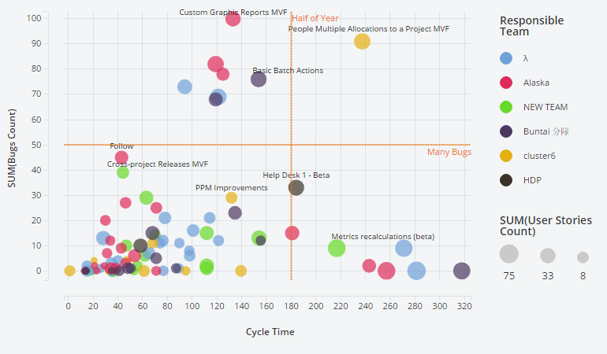
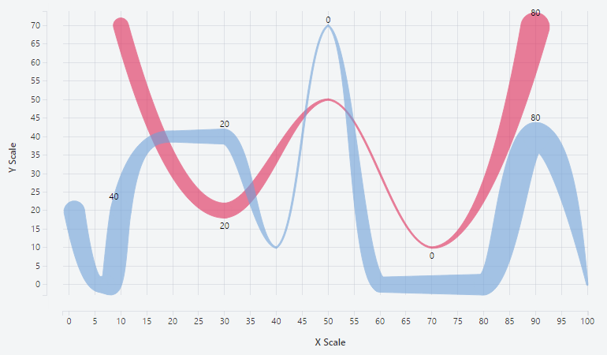
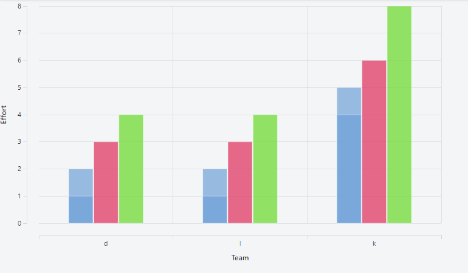
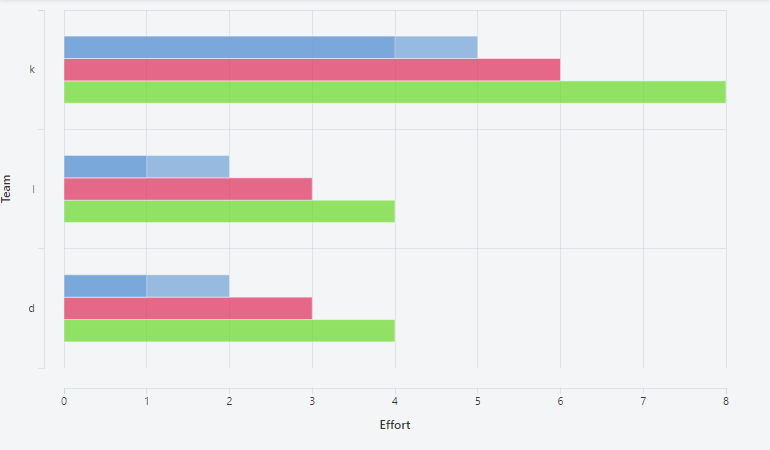
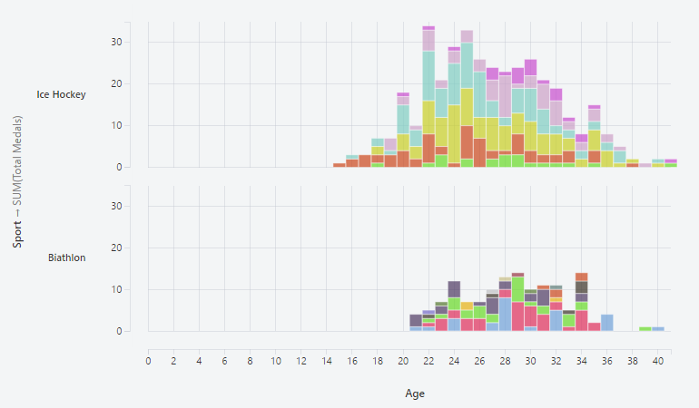
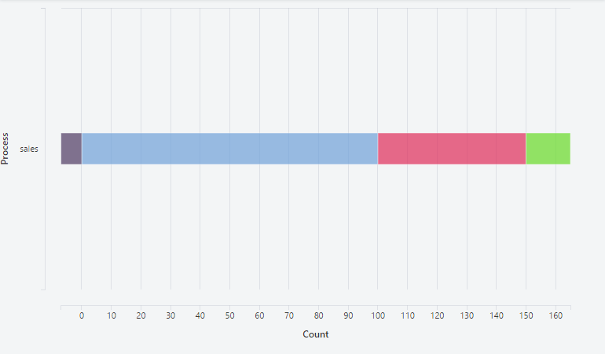
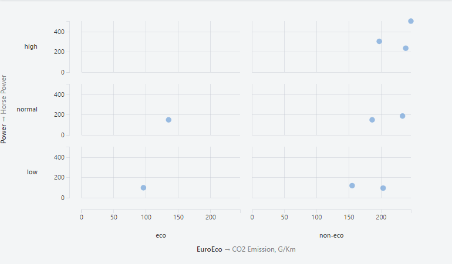
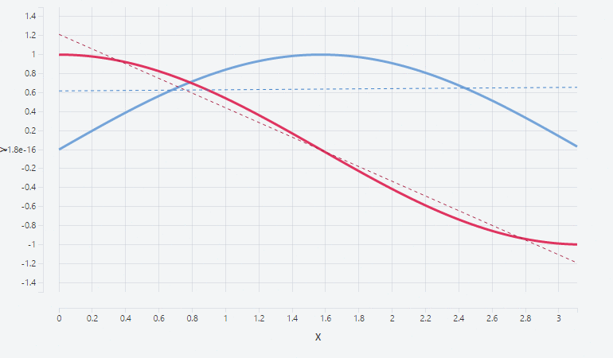
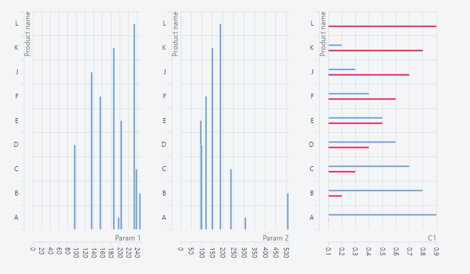

Taucharts [](https://travis-ci.org/TargetProcess/tauCharts) [](https://coveralls.io/r/TargetProcess/tauCharts) [](https://codeclimate.com/github/TargetProcess/tauCharts)
[](http://slack.taucharts.com/)
======


Taucharts is a [data-focused JavaScript charting library](http://blog.taucharts.com/taucharts-data-focused-charting-library/) based on D3 and designed with passion.

##### Official website: [www.taucharts.com](http://www.taucharts.com)
##### Documentation: [api.taucharts.com](http://api.taucharts.com)
##### Project blog: [blog.taucharts.com](http://blog.taucharts.com)

## Why use Taucharts?
#### Simplicity
Data plays a key role in Taucharts. The library provides a declarative interface for fast mapping of data fields to visual properties.
#### Flexibility
The library's architecture allows you to build [facets](http://api.taucharts.com/basic/facet.html) and extend chart behaviour with reusable plugins.
#### Design
The Taucharts team is passionate about beautiful design.
#### ...
Dive into the high-level [Taucharts concepts](http://blog.taucharts.com/taucharts-data-focused-charting-library/) and [usage reviews](#taucharts-examples--usage-reviews).
If you want to contribute - see [how to run the project locally](#how-to-run-the-project-locally)

## How to use Taucharts

#### Using Taucharts with a CDN

Load JavaScript dependencies

```html
<script src="//cdn.jsdelivr.net/d3js/latest/d3.min.js" charset="utf-8"></script>
<script src="//cdn.jsdelivr.net/taucharts/latest/taucharts.min.js" type="text/javascript"></script>
```

Include a CSS file, as well

```html
<link rel="stylesheet" type="text/css" href="//cdn.jsdelivr.net/taucharts/latest/taucharts.min.css">
```

#### Downloading Taucharts using Bower

```bash
bower install taucharts
```

#### Downloading Taucharts using npm

```bash
npm install taucharts
```

___

Below are some popular usage scenarios. For more examples, see our experimental [sample page](https://demo.taucharts.com/).

#### Scatter plot
```javascript
var chart = new Taucharts.Chart({
    type   : 'scatterplot',
    x      : 'Cycle Time',
    y      : 'SUM(Bugs Count)',
    color  : 'Team',
    size   : 'Sum(User Stories Count)',
    data   : [{'Cycle Time': 186, 'SUM(Bugs Count)': 34, 'Team': 'HDP'...}, ...],
    plugins: [
        Taucharts.api.plugins.get('legend'),
        Taucharts.api.plugins.get('tooltip')
    ]
});
```
[](http://api.taucharts.com/basic/scatterplot.html)

See [scatter plot documentation](http://api.taucharts.com/basic/scatterplot.html)

___

#### Line chart
```javascript
var chart = new Taucharts.Chart({
    type : 'line',
    y    : 'Y Scale',
    x    : 'X Scale',
    color: 'Team',
    size : 'Effort',
    label: 'Effort',
    data : [{'Team': 'Alpha', 'Effort': 40, 'Y Scale': 23, 'X Scale': 72 }, ...]
});
```
[](http://api.taucharts.com/basic/line.html)

See [line chart documentation](http://api.taucharts.com/basic/line.html)

___

#### Bar chart
```javascript
var chart = new Taucharts.Chart({
    type : 'bar',
    x    : 'team',
    y    : 'effort',
    color: 'priority',
    data : [{'team': 'd', 'effort': 1, 'count': 1, 'priority': 'low'}, ...]
});
```
[](http://api.taucharts.com/basic/bar.html)

See [bar chart documentation](http://api.taucharts.com/basic/bar.html)

___

#### Horizontal bar chart
```javascript
var chart = new Taucharts.Chart({
    type : 'horizontal-bar',
    x    : 'count',
    y    : 'team',
    color: 'priority',
    data : [{'team': 'alpha', 'effort': 8, 'priority': 'major'}, ...]
});
```
[](http://api.taucharts.com/basic/horizontal-bar.html)

See [horizontal bar chart documentation](http://api.taucharts.com/basic/horizontal-bar.html)

___

#### Stacked bar chart
```javascript
var chart = new Taucharts.Chart({
    type : 'stacked-bar',
    x    : 'age',
    y    : ['count', 'sport'],
    color: 'country',
    data : [{country: 'Canada', sport: 'Biathlon', medals: 20, age: 22}, ...]
});
```
[](http://api.taucharts.com/basic/stacked-bar.html)

See [stacked bar chart documentation](http://api.taucharts.com/basic/stacked-bar.html)

___

#### Horizontal stacked bar chart
```javascript
var chart = new Taucharts.Chart({
    type : 'horizontal-stacked-bar',
    y    : 'process',
    x    : 'count',
    color: 'stage',
    data : [{process: 'sales', stage: 'visit', count: 100}, ...]
});
```
[](http://api.taucharts.com/basic/horizontal-stacked-bar.html)

See [horizontal stacked bar chart documentation](http://api.taucharts.com/basic/horizontal-stacked-bar.html)

___

#### Stacked area chart
```javascript
var chart = new Taucharts.Chart({
    type : 'stacked-area',
    y    : 'effort',
    x    : 'date',
    color: 'team',
    guide: {
        interpolate: 'smooth'
    },
    data : [{date: '2015-07-15', effort: 400, team: 'Alpha'}, ...]
});
```
[](http://api.taucharts.com/basic/stacked-area.html)

See [stacked area chart documentation](http://api.taucharts.com/basic/stacked-area.html)

___

#### Facet chart
```javascript
var chart1 = new Taucharts.Chart({
  type : 'scatterplot',
  x    : ['milespergallon'],
  y    : ['class', 'price'],
  color: 'class',
  data : [{class: "C", milespergallon: 41.26, price: 24509.74, vehicle: "Prius1"}, ...]
});
```
[](http://api.taucharts.com/basic/facet.html)

See [facet charts documentation](http://api.taucharts.com/basic/facet.html)

___

#### Data Streaming
```javascript
var chart1 = new Taucharts.Chart({
    type : 'line',
    x    : 'x',
    y    : 'y',
    color: 'type',
    ...
});
```
[](//jsfiddle.net/taucharts/qdn76nab/)

This sample uses the [setData(..)] method to refresh the chart's data source.

See [streaming sample online](//jsfiddle.net/taucharts/qdn76nab/)

___

#### Complex Composable charts
[](http://jsfiddle.net/6LzefLo4/4/)

See [composable chart sample online](http://jsfiddle.net/6LzefLo4/4/)

___

## How to run the project locally

Clone (forked) repository:
```
git clone https://github.com/TargetProcess/tauCharts.git
```

Initialize dependencies:
```
npm install
```

Run local webpack dev server (with hot reload):
```
npm start
```

Local server will be started on port 9000 and live taucharts assembly will be exposed by url:
```
http://localhost:9000/dist/taucharts.js
```

Now you can see some taucharts examples:
```
http://localhost:9000/examples/
```

To run tests (with hot reload):
```
npm run devtest
```

To build a static assembly:
```
npm run build
```
This command creates development and production assemblies in a *[./dist]* folder.

## Taucharts examples / usage reviews

[R Wrapper](http://www.buildingwidgets.com/blog/2015/8/5/week-31-taucharts)

[SqlPad Project](http://rickbergfalk.github.io/sqlpad/chart-tutorials/)

[Targetprocess Graphical Reports](https://www.targetprocess.com/blog/2015/09/prototype-for-new-custom-graphical-reports-editor/)

[Vizydrop project](http://vizydrop.com/)

[Taucharts Twitter channel](https://twitter.com/search?q=taucharts)

[Taucharts demo page](https://demo.taucharts.com/)

[GeoTremor mobile app](http://geotremor.tangentapps.com)

## License

Licensing: [Apache License, Version 2.0](http://www.apache.org/licenses/LICENSE-2.0)

Have questions? [Contact us](mailto:michael@targetprocess.com)
